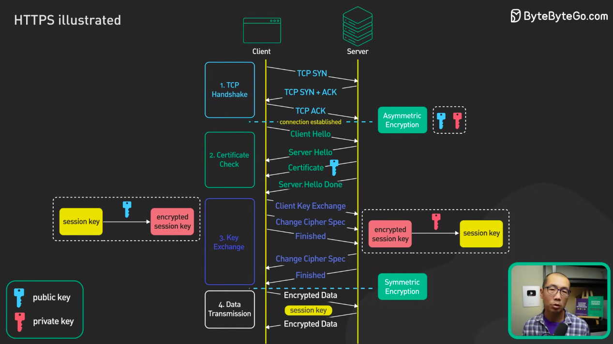

# TLS Handshake with Keystore and Truststore

## Rangkuman Singkat TLS Handshake (Urutan Lengkap)

| Tahap | Aksi | Dilakukan oleh | Menggunakan | Penjelasan |
|-------|------|----------------|--------------|-------------|
| **1** | **ClientHello** | Client | — | Client memulai koneksi dengan menawarkan daftar cipher, versi TLS, dan parameter keamanan yang didukung. |
| **2** | **ServerHello + Certificate** | Server | **Keystore (Public Certificate)** | Server memilih konfigurasi TLS yang sesuai dan mengirim **sertifikat publik** dari keystore agar client bisa memverifikasi identitasnya. |
| **3** | **Verifikasi Certificate** | Client | **Truststore (CA Certificates)** | Client memeriksa validitas sertifikat server terhadap daftar CA terpercaya dalam truststore. Jika valid, lanjut ke tahap berikut. |
| **4** | **ClientKeyExchange** | Client | **Public Key dari Sertifikat Server** | Client membuat **session key (kunci simetris)** dan **mengenkripsinya dengan public key server**, lalu mengirim ke server. |
| **5** | **Decrypt Session Key** | Server | **Private Key (dalam Keystore)** | Server mendekripsi session key menggunakan private key-nya. Sekarang client dan server memiliki session key yang sama. |
| **6** | **Finished (Handshake selesai)** | Keduanya | **Session Key (Symmetric)** | Keduanya mulai berkomunikasi dengan enkripsi simetris menggunakan session key ini. |

---

## Inti Logika Urutannya
1. **Client memulai** karena ingin koneksi aman.  
2. **Server merespons** dengan identitas (sertifikat publik).  
3. **Client memverifikasi keaslian** server.  
4. **Client membuat kunci rahasia (session key)** dan mengirim secara aman.  
5. **Server membuka session key** dengan private key-nya.  
6. **Komunikasi terenkripsi simetris dimulai.**

## Ilustration
